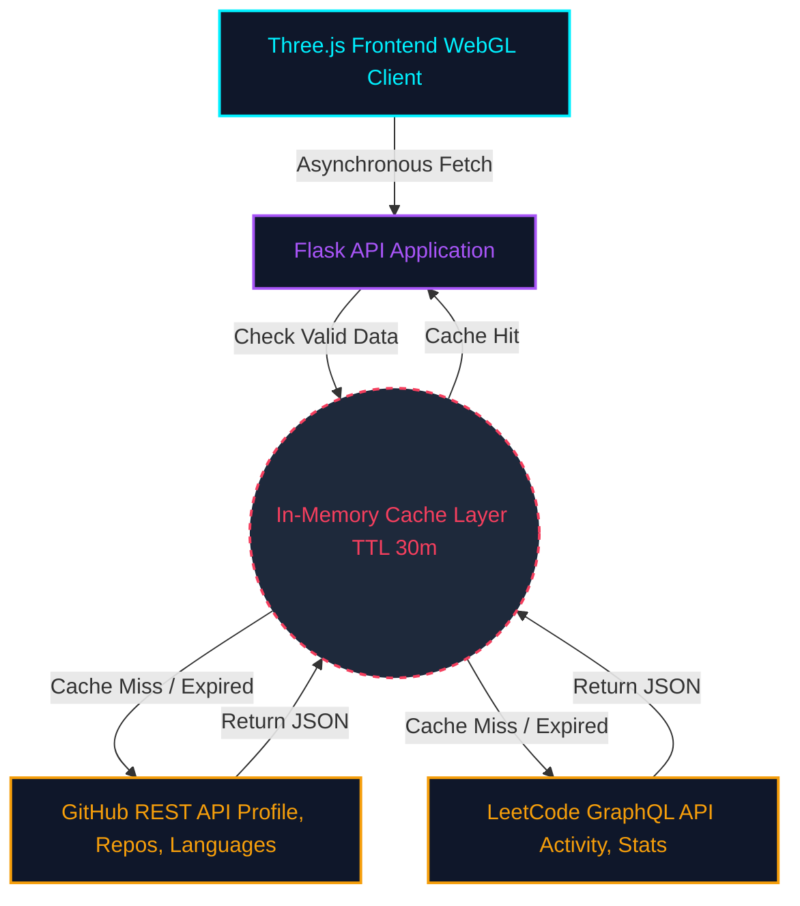

<div align="center">

[](https://portfolio-lilac-delta-c1kxu40gza.vercel.app)

[](https://portfolio-lilac-delta-c1kxu40gza.vercel.app)

</div>

<br/>

Welcome to the source code of my personal developer portfolio. This isn't just a static HTML page; it's a dynamic, high-performance web application designed to demonstrate my capabilities in backend engineering, API integration, and frontend 3D rendering.

## 🏗️ System Architecture

Unlike most portfolios, this application dynamically pulls my real-time coding activity while meticulously managing external API rate limits through a custom caching layer.



## 🛠️ Engineering Highlights

- **Intelligent API Caching (Backend):** To prevent hitting the severe rate limits of the LeetCode and GitHub APIs, the Flask backend implements a custom Time-To-Live (TTL) cache. It safely stores the fetched payloads for 30 minutes, ensuring ultra-fast load times for the frontend.
- **Interactive WebGL Rendering (Frontend):** Integrates `Three.js` for stunning, interactive background elements. The 3D graphics are optimized to maintain a high framerate without dominating the main JavaScript thread.
- **Glassmorphic UI/UX:** A modern, clean, responsive layout constructed with CSS3, avoiding heavy CSS frameworks to ensure maximum performance and precise visual control.

## 💻 Tech Stack

<p align="center">
  
  
  
  
</p>
<p align="center">
  
  
</p>
<p align="center">
  
  
</p>

## 🚀 Local Development Setup

To run this application locally and explore the architecture yourself, follow this terminal workflow.

**1. Clone & Navigate**
```bash
git clone https://github.com/rajmaheshwari3001-dev/portfolio.git
cd portfolio
```

**2. Isolate Dependencies**
```bash
python -m venv venv

# Windows Activation:
venv\Scripts\activate

# macOS/Linux Activation:
source venv/bin/activate
```

**3. Install Requirements**
```bash
pip install -r requirements.txt
```

**4. Environment Variables**
> [!TIP]
> To bypass GitHub's unauthenticated IP rate limits, export a Personal Access Token.

```bash
# Windows (PowerShell)
$env:GITHUB_TOKEN="your_token_here"

# macOS/Linux
export GITHUB_TOKEN="your_token_here"
```

**5. Boot the Server**
```bash
python app.py
```
*The API and Frontend will now be served at [http://localhost:5000](http://localhost:5000).*

## 📁 Repository Map

```text
portfolio/
├── services/               # API interaction logic (GitHub/LeetCode)
│   ├── github_service.py
│   └── leetcode_service.py
├── static/                 # Static assets (CSS, JS, 3D Models)
├── templates/              # Flask Jinja2 HTML templates
│   └── index.html
├── app.py                  # Main Flask application & Caching Router
├── config.py               # Application configurations & secrets mapping
├── requirements.txt        # Python dependency manifest
└── README.md               # You are here
```

## 📬 Let's Connect

If you're interested in the architecture or just want to chat about software engineering, reach out!

<p align="left">
  <a href="https://www.linkedin.com/in/raj-maheshwari-6293683a4/" target="_blank">
    
  </a>
  <a href="https://github.com/rajmaheshwari3001-dev" target="_blank">
    
  </a>
  <a href="mailto:rajmaheshwari3001@gmail.com" target="_blank">
    
  </a>
</p>
