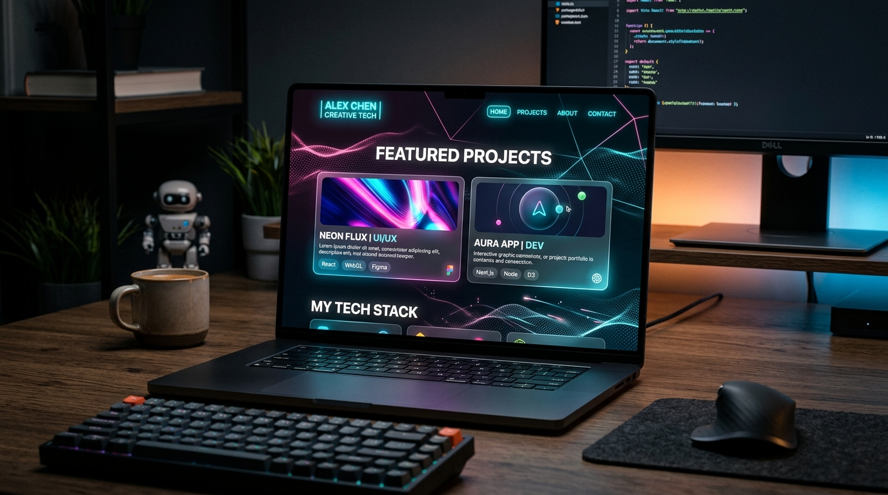
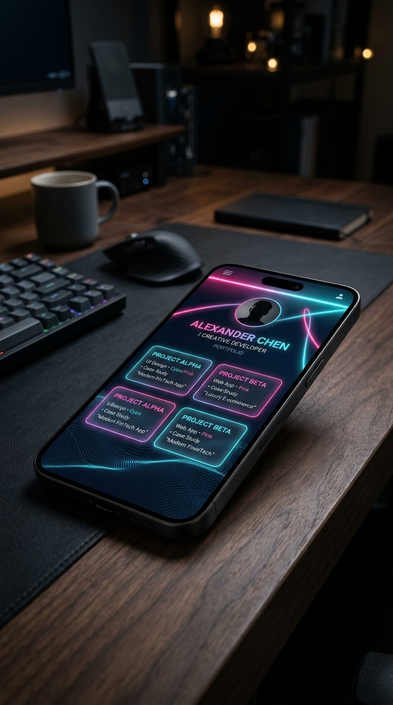
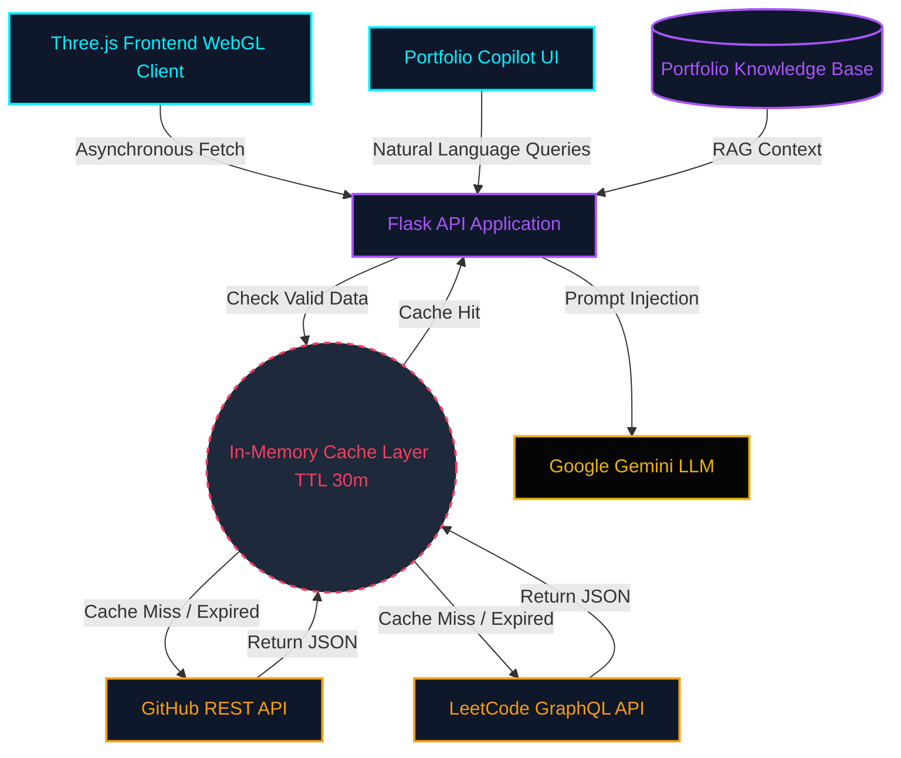

<div align="center">

# ✦ Portfolio Website - v2.0 ✦
<h3><a href="https://portfolio-lilac-delta-c1kxu40gza.vercel.app">portfolio.rajmaheshwari.tech</a></h3>

<br/>

<p align="center">
  
  
</p>

<br/><br/>

<p align="center">
  
  
  
  
  
</p>

<p align="center">
  <a href="https://github.com/rajmaheshwari3001-dev/portfolio/issues"><b>🔷 Report Bug</b></a>
  &nbsp;&nbsp;&nbsp;|&nbsp;&nbsp;&nbsp;
  <a href="https://github.com/rajmaheshwari3001-dev/portfolio/issues"><b>🔷 Request Feature</b></a>
</p>

</div>

---

## ⚡ TL;DR

Welcome to the source code of my personal developer portfolio. This isn't just a static webpage; it's a **high-performance, luxury-themed web application** designed to demonstrate my capabilities in backend engineering, API integration, interactive UNIX terminal simulation, and premium frontend design.

You can fork this repo to modify and make changes of your own. Please give me proper credit by linking back to [rajmaheshwari3001-dev](https://github.com/rajmaheshwari3001-dev). Thanks!

---

## 🏗️ System Architecture

This application dynamically pulls my real-time coding activity while meticulously managing external API rate limits through a custom caching layer.



## ✨ Engineering Highlights

- **🧠 Portfolio Copilot (AI Assistant):** A fully integrated, context-aware digital representation of myself. Powered by Google Gemini, visitors can ask questions, get dynamic project recommendations, and be automatically scrolled to relevant sections. It features a custom knowledge-base designed to completely eliminate hallucination.
- **🎬 Cinematic Teleportation Navigation:** A completely bespoke, state-machine-controlled transition engine. When navigating via the terminal, users experience a superhero-style cinematic arrival featuring procedural SVG lightning, screen shake, and high-contrast energy flashes.
- **⚙️ Generative WebGL Architecture:** Features a stunning, fluid particle wave background rendered with Three.js that reacts dynamically to mouse and scroll physics, simulating liquid obsidian and gold.
- **📱 Tech Luxury UI & Fluid Typography:** Utilizes mathematical `clamp()` functions to ensure typography acts like water—scaling perfectly on every device. Fully optimized for a mobile-first premium experience.
- **⚡ Intelligent API Caching:** To prevent hitting the severe rate limits of the LeetCode and GitHub APIs, the Flask backend implements a custom Time-To-Live (TTL) cache. It safely stores the fetched payloads for 30 minutes, ensuring ultra-fast load times.
- **🔍 SEO & Accessibility Mastery:** 100% accessible via keyboard navigation, screen-reader optimized using dynamic `aria-hidden` tags, and architected with an SEO-first semantic layout featuring precise `meta` tags.
- **🌗 Seamless Dark/Light Engine:** Real-time CSS variable toggling combined with persistent `localStorage` saving, dynamically altering colors and glassmorphic card densities without a page refresh.

<details>
<summary><b>💻 View Tech Stack</b></summary>
<br>

<p align="center">
  
  
  
  
</p>
<p align="center">
  
  
</p>
<p align="center">
  
  
</p>
</details>

## 🚀 Local Development Setup

To run this application locally and explore the architecture yourself, follow this terminal workflow.

<details>
<summary><b>View Setup Instructions</b></summary>
<br>

**1. Clone & Navigate**
```bash
git clone https://github.com/rajmaheshwari3001-dev/portfolio.git
cd portfolio
```

**2. Isolate Dependencies**
```bash
python -m venv venv

# Windows Activation:
venv\Scripts\activate

# macOS/Linux Activation:
source venv/bin/activate
```

**3. Install Requirements**
```bash
pip install -r requirements.txt
```

**4. Environment Variables**
> [!TIP]
> To bypass GitHub's unauthenticated IP rate limits, export a Personal Access Token.

```bash
# Windows (PowerShell)
$env:GITHUB_TOKEN="your_token_here"

# macOS/Linux
export GITHUB_TOKEN="your_token_here"
```

**5. Boot the Server**
```bash
python app.py
```
*The API and Frontend will now be served at [http://localhost:5000](http://localhost:5000).*
</details>

## 📁 Repository Map

```text
portfolio/
├── services/               # API interaction logic (GitHub/LeetCode)
│   ├── github_service.py
│   └── leetcode_service.py
├── static/                 # Static assets (CSS, JS, 3D Models)
├── templates/              # Flask Jinja2 HTML templates
│   └── index.html
├── app.py                  # Main Flask application & Caching Router
├── config.py               # Application configurations & secrets mapping
├── portfolio_data.json     # Structured Knowledge Base for Portfolio Copilot
├── requirements.txt        # Python dependency manifest
└── README.md               # You are here
```

## 📬 Let's Connect

If you're interested in the architecture or just want to chat about software engineering, reach out!

<p align="left">
  <a href="https://www.linkedin.com/in/raj-maheshwari-6293683a4/" target="_blank">
    
  </a>
  <a href="https://github.com/rajmaheshwari3001-dev" target="_blank">
    
  </a>
  <a href="mailto:rajmaheshwari3001@gmail.com" target="_blank">
    
  </a>
</p>
